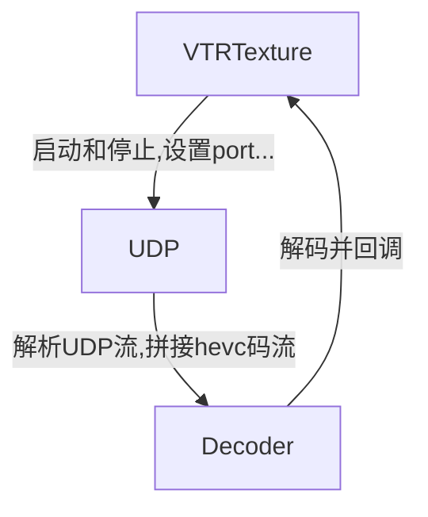

# Video Transmission Receiver (VTR)
这是MasterPilot的图传接收模块,封装了从UDP到Godot纹理的全部操作

**注意: 本模块仅支持linux环境**

## 使用方法
- 编译项目,添加到addons (参考example文件夹)
- 创建一个能渲染Texture2D的控件,比如TextureRect,设置Texture为VTRTexture,并且设置UDP属性,将active设为true

**注: 如果多个地方需要使用同一图传,需要创建一个资源,并在多个地方引用这个资源,从而避免重复启动UDP和解码**

## 架构


## 环境配置
### C++依赖 
- FFmpeg (libavcodec,libavutil)
- libswscale

### Godot-CPP环境
- 确保已经使用`git submodule`来克隆godot-cpp库,并且正确软链接到本目录
- 按照[ godot-cpp教程 ]( https://docs.godotengine.org/en/stable/tutorials/scripting/cpp/gdextension_cpp_example.html ) 配置godot-cpp环境
- 配置godot到环境变量
- 配置clangd需要的语法分析环境:
    ```sh
    cd godot-cpp
    # 提供godot-cpp api绑定所需数据
    godot --dump-extension-api
    scons platform=linux custom_api_file=extension_api.json
    # 提供clangd compiledb
    scons compiledb=yes compile_commands.json
    cd..
    ```
- 配置本模块的环境
    ```sh
    # 导出godot路径软链接,用于attach调试
    ln -s $(which godot) .godot_bin
    # compiledb
    scons compiledb=yes compile_commands.json
    # 创建编译输出文件的软链接
    ln -s ../../../../bin/libvtrtexture.linux.template_debug.dev.x86_64.so example/addons/vtr_texture/bin/libvtrtexture.linux.template_debug.dev.x86_64.so
    ```
- 配置mock的环境
    略

## 开发指南

### 导出compiledb
**注: 项目中的SCons已经配置了自动导出compiledb, 如果godot-cpp一堆报错才使用**
```sh
scons compiledb=yes compile_commands.json
```

### 编译
Debug版本
```sh
scons platform=linux target=template_debug dev_build=yes
```

### 调试

- 确保launch选中`Attach GDExtension (Linux)`
- Godot启动要调试的场景
- 启动调试(F5), 输入godot, 找启动命令里面带`.tscn`的
- 通常这个时候终端会要求确认,输入y,再输入管理员密码